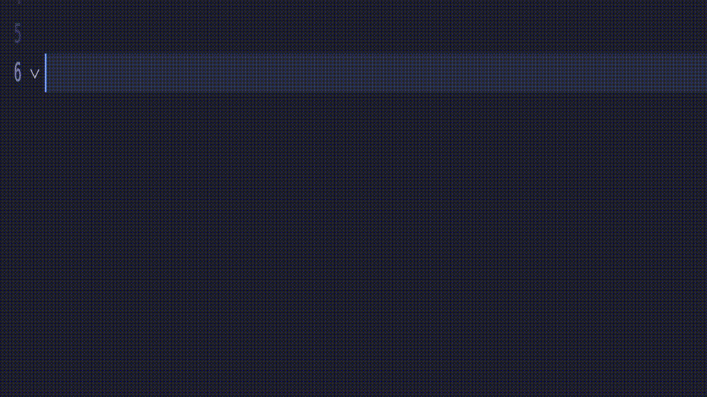

# Cairo extension (unofficial)

## Introduction

The Starkware team is doing a great job in developing the Cairo language and the Starknet layer2. At the time I create this repository, the team is focused on issues and improvements (regenesis, cairo v1...) much more important than the development of the vscode extension, which is absolutely fine. However, since the vscode extensions lives in the [cairo-lang](https://github.com/starkware-libs/cairo-lang) monorepo its non-priority development is slowed down.

This repository is a way to relieve the Starkware teams by out-sourcing the development of the vscode extension. I don't think that the [cairo-lang](https://github.com/starkware-libs/cairo-lang) monorepo is the right place to host a product like this one whose development dynamics and code severity is different from the language itself.

This extension is intended to support all the features developed by Starkware up to now, and to add to it features that make the development of programs written in Cairo smoother.



## Installation

Make sure you installed [`vsce`](https://www.npmjs.com/package/vsce) globally and you installed the dependencies of this repository. These steps only need to be done once

```bash
npm install -g vsce
npm install
```

## Install current version of the extension on vscode

Run the following command to package the extension and install it locally

```bash
npm run package && npm run deploy:local
```

## Configuration

If you have `cairo-format` installed globally (available in PATH), the value of
`cairo.cairoFormatPath` should be `cairo-format` (the default).

If you're working inside a StarkWare repository, and want the most up-to-date version,
set the value of `cairo.cairoFormatPath` to

```
${workspaceFolder}/src/starkware/cairo/lang/scripts/cairo-format
```

## Comparison

This extension supports all the features developed by Starkware, plus

- A new snippet for the `@view` decorator
- A new snippet for the `@constructor` decorator
- A new snippet for the `@raw_input` decorator
- A new snippet for the `@raw_output` decorator
- A new snippet that let you create a function that uses both the `@raw_input` and `@raw_output` decorators
- An improvement that allows you to write a `@storage_var` mapping more easily
- A new snippet to write `struct`
- A new snippet for the allocation point `ap`
- It auto-close parenthesis/curly braces
- It allows you to surround your selection with parenthesis/curly braces
